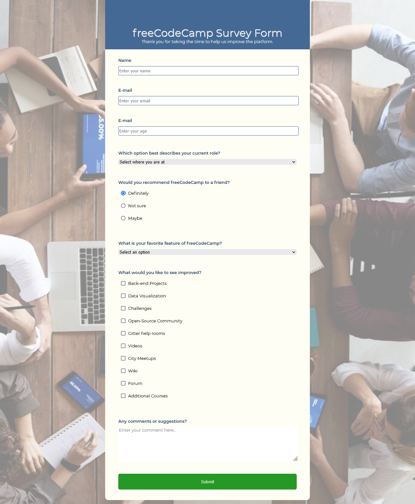

_This README.md file is in English and Portuguese. // Esse arquivo README.md está em Inglês e Português._

# EN: Freecodecamp #02 Responsive Web Design Project: Survey Form

This repository contains my solution to the freecodecamp #02 challenge on "Responsive Web Design Project". This is part of a series of incremental HTML and CSS Projects in order to obtain the "Responsive Web Design" certificate from Freecodechallenge.

This first challenge was supposed to create a very simple Tribute Page with HTML and CSS. The second challenge is presented here: the creation of a simple Survey with HTML and CSS. More challenges follow this one.

## Responsive Web Design Projects:

1. Simple Ada Lovelace Tribute Page
2. **A freeCodeCamp Survey Form**

The main goal is to practice the content seen in the course in order to achieve the necessary solution required to go to the next step.

### MY SOLUTION

# EN: Freecodecamp #02 Responsive Web Design Project: Formulário de perguntas

Esse repositório contém a minha solução para o desafio número 02 do freecodecamp do curso "Responsive Web Design". Isso é parte de uma série de projetos incrementais em HTML e CSS requisitados para obtenção do certificado em "Responsive Web Design" do Freecodecamp.

O primeiro desafio era para criar um versão muito simples de uma página tributo ("homenagem") feita apenas em HTML e CSS. Este presente segundo desafio aqui mostrado é a criação de um formulário de perguntas feito com HTML e CSS. Mais desafios seguem esse. 

## Projetos do "Responsive Web Design Projects":

1. Simple Ada Lovelace Tribute Page
2. **A freeCodeCamp Survey Form**

O principal objetivo é praticar o conteúdo visto no curso e alcançar a solução necessária para ir para a próxima etapa.

### MY SOLUTION

